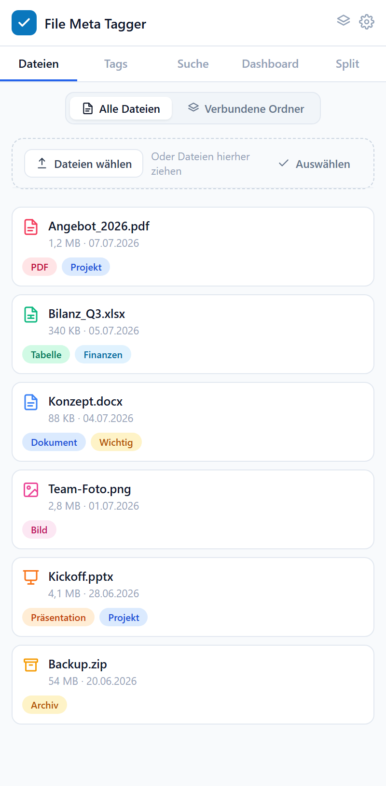
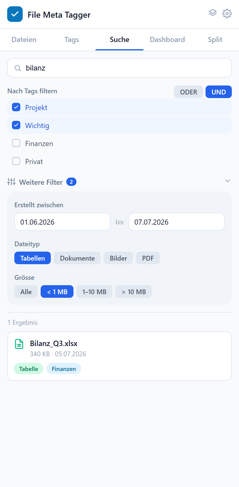
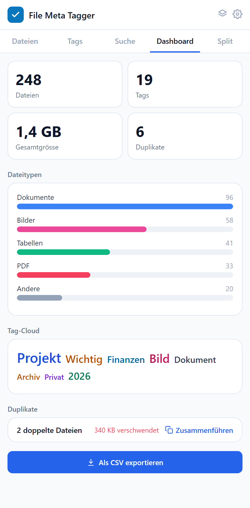
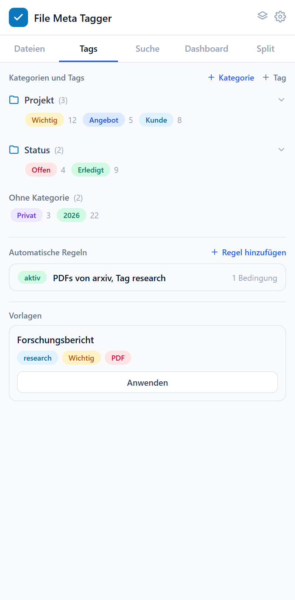
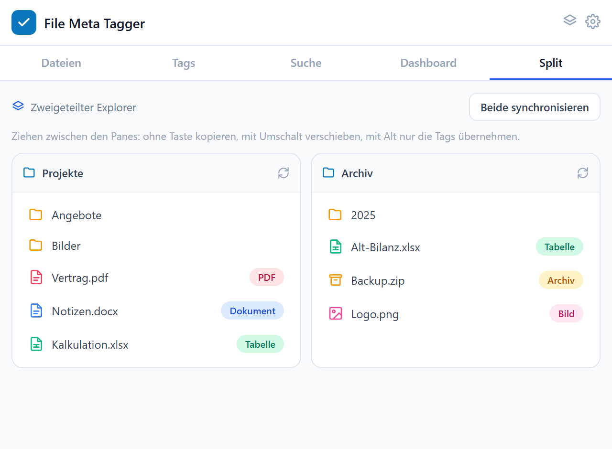
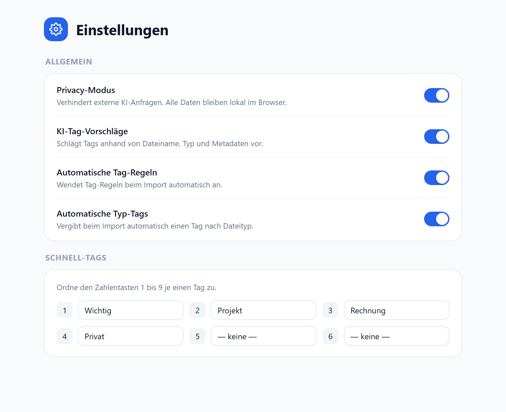

# FileMeta Tagger

Werkzeug zum **Verschlagworten und Organisieren von Dateien** im Browser. Dateien werden mit Tags und Kategorien versehen und lassen sich danach schnell wiederfinden. Alle Daten bleiben lokal im Browser.

> Entwickelt während meines Praktikums. Die Screenshots zeigen Beispieldaten.

## Was das Tool macht

- **Dateien verwalten:** Dateien hinzufügen oder per Drag & Drop ablegen, dazu Ordner verbinden. Jede Datei bekommt Tags.
- **Tags und Kategorien:** Tags lassen sich in Kategorien gruppieren. Es gibt automatische Regeln (zum Beispiel «PDFs von arxiv erhalten den Tag research»), Vorlagen und Schnell-Tags auf den Zifferntasten 1 bis 9.
- **Suche und Filter:** Volltextsuche, Tag-Filter mit UND/ODER, dazu Filter nach Datum, Dateityp und Grösse.
- **Dashboard:** Anzahl Dateien und Tags, Gesamtgrösse, Verteilung nach Dateityp und Tag-Cloud. Erkennt Duplikate, zeigt den verschwendeten Speicher und kann sie zusammenführen. Export als CSV.
- **Split-Ansicht:** Zweigeteilter Explorer. Beim Ziehen zwischen den Fenstern wird kopiert, mit Umschalttaste verschoben, mit Alt werden nur die Tags übernommen.
- **KI-Tag-Vorschläge** anhand von Dateiname, Typ und Metadaten. Der Privacy-Modus verhindert externe KI-Anfragen.

## Screenshots

### Dateien

### Suche und Filter

### Dashboard

### Tags und Kategorien

### Split-Ansicht

### Einstellungen

